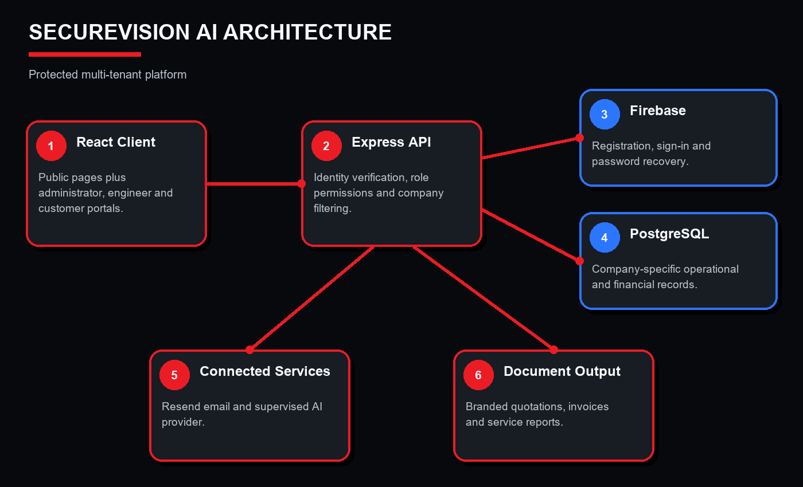

# SecureVision AI

SecureVision AI is a local assessment prototype for security installation and service businesses. It combines a React web client, Express API and PostgreSQL database with Firebase authentication, PDF documents, email delivery and optional AI assistance.

This repository distributes the completed artefact and selected supporting evidence. It is not a hosted live service. The university portal submission remains the assessment submission. 

## Included

- `src/`: public website and administrator, engineer and customer interfaces.
- `server/`: API, authentication, validation, business logic, PDF generators and 16 SQL migrations.
- `tests/`: automated regression tests.
- `public/`: application logo.
- `docs/designs/`: original architecture, data-model and workflow diagrams.
- `docs/testing/`: selected historical test evidence and a separate packaging verification record.

## Requirements

- Node.js 22.12 or later, with npm. Dependencies are resolved by `package-lock.json`; use `npm ci`.
- An empty PostgreSQL database for persistent workflows and company separation.
- A Firebase project with Authentication configured, frontend configuration values and server credentials.
- Python 3 with ReportLab and Pillow for PDF generation.
- A Resend account for external email; an optional AI provider configuration for provider-dependent functionality.

## Run locally

1. Download or clone this repository and open a terminal in the directory containing `package.json`.
2. Install JavaScript dependencies:

   ```sh
   npm ci
   ```

3. Copy `.env.example` to `.env`. On Windows PowerShell:

   ```powershell
   Copy-Item .env.example .env
   ```

4. Set `DATABASE_URL` to your own empty PostgreSQL database connection string, then run:

   ```sh
   npm run db:migrate
   ```

5. Supply the four `VITE_FIREBASE_*` values. Enable the sign-in providers you intend to assess and authorise your local frontend domain in Firebase. Set `GOOGLE_APPLICATION_CREDENTIALS` to your Firebase Admin credential file stored outside this repository, or provide credentials through your environment. Keep `DEV_AUTH_BYPASS=false` for authenticated assessment.

6. Install the Python PDF dependencies with the interpreter that will run the generators:

   ```sh
   python -m pip install -r requirements.txt
   ```

   On systems using `python3`, use that command instead. If needed, set `PDF_PYTHON_BIN` in `.env` to the full path of that interpreter. The default is `python` on Windows and `python3` elsewhere.

7. Start the API and frontend:

   ```sh
   npm run dev:all
   ```

8. Open [the local prototype](http://127.0.0.1:5173/app). The API defaults to `http://127.0.0.1:3001/api`. These addresses work only on the computer running the prototype. If Vite chooses another port because 5173 is occupied, free that port or update the frontend URL and `CORS_ORIGIN` together.

With a new database, the first authenticated application user becomes the initial administrator. Use your own assessment account and configure the company profile. Additional users need invitations from the administrator. Use separate test accounts and companies to assess role and company separation.

## Optional services and limitations

Set `RESEND_API_KEY`, an authorised `EMAIL_FROM`, and `CONTACT_TO_EMAIL` to test outgoing messages. Set `APP_PUBLIC_URL` to an address reachable by email recipients when testing links on other devices. Localhost links in email cannot reach a prototype running on a different computer.

Set `OPENAI_API_KEY` and `OPENAI_MODEL` if assessing external model-dependent features. Without provider configuration, the application uses its implemented local logic where available; this does not demonstrate external model execution.

Without `DATABASE_URL`, the API has limited in-memory behaviour. This is not equivalent to the persistent, authenticated assessment configuration. `DEV_AUTH_BYPASS=true` is available only for isolated development demonstrations and must not be used to demonstrate secure authentication or for public hosting.

The original project required local configuration and was not packaged as a production deployment. A successful build or unit-test run does not verify Firebase, PostgreSQL integration, email delivery, all browser workflows or production security. Marketing wording in prototype screens is not an independent security certification.

## Verification

```sh
npm run check
```

This runs the automated tests and production build. See [packaging verification](docs/testing/verification.md) for the results recorded for this upload copy. The existing historical test screenshot is labelled separately; it has not been altered to represent a new run.

## Evidence and public-upload changes



The included diagrams and historical test screenshot are unchanged original evidence. The screenshot contains a local Windows working-directory path; it is not an access link. Design diagrams describe the intended structure and are not proof of comprehensive security testing.

The supplied `Design pages` directory contained no files. Operational screenshots showing account/customer details, research records, the dissertation and the demonstration video are not included in this public repository. They remain in the university submission.

This public upload copy contains these preparation changes:

- A root README, Python dependency list and stricter `.gitignore`.
- A credential-free `.env.example` with authentication bypass disabled by default.
- A portable Python executable fallback replacing a developer-specific path in `server/pdf.js`.
- Neutral example contact details and personal-name replacements in demo UI/fixtures and one validation test. Sample email domains use `example.com`; business logic and assertions are retained.

The original local project and original research evidence were preserved. No `.env`, credentials, database export, dependency directory, build output, temporary artefact or Git history is included. Public visibility does not imply that a deployment has been security-audited.
